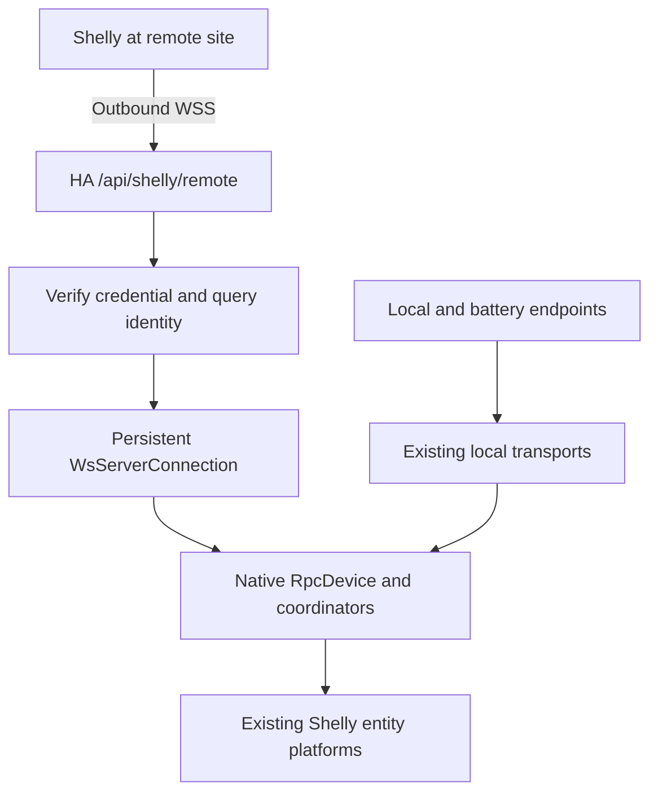

# Architecture

## Shared entities, different connection ownership

| Mode                          | Connection                                                    | HA config entry                                                                                 | Server                                               |
| ----------------------------- | ------------------------------------------------------------- | ----------------------------------------------------------------------------------------------- | ---------------------------------------------------- |
| Local Gen2+                   | HA opens the device's WebSocket                               | Existing `host`, port and device MAC                                                            | Existing local context                               |
| Local sleeping device         | Device pushes wake-up updates; existing HA behavior continues | Existing local entry                                                                            | `/api/shelly/ws`                                     |
| Remote mains-powered Gen2/3/4 | Device opens WSS to HA; HA sends RPC on the same socket       | `connection_type: remote_ws`, unique MAC, credential hash, generation, model, sleep period zero | Separate `/api/shelly/remote` manager and `WsServer` |

The remote entry has no `CONF_HOST`. It constructs `ConnectionOptions(remote_device_id=entry.unique_id)` and calls `RpcDevice.create(None, remote_server, options)`. Entity platforms share the existing Shelly coordinators and RPC methods. Camera is excluded because it needs direct HTTP/RTSP. Remote BLE proxy scanning is excluded; its existing scanner protocol is outside this remote RPC transport.

## Pairing

1. An HA administrator selects the remote connection mode in the normal Shelly config flow.
2. HA obtains a supported external HTTPS URL or asks for a public HTTPS origin. It does not probe that origin or contact a private Shelly address.
3. HA generates a 256-bit credential, keeps a SHA-256 verifier and displays a sensitive WSS URL during the active pairing flow.
4. The device connects using that credential. HA requires a secure request, rejects browser Origin headers and authenticates before WebSocket upgrade.
5. HA sends `Shelly.GetDeviceInfo` on the candidate socket, requiring matching response source, ID/MAC suffix, MAC, generation, model and firmware fields.
6. HA binds the verifier to the queried MAC, checks existing entries and competing credentials, then attaches the socket to the separate remote server.
7. The user confirms identity within the pairing deadline. HA fetches `Shelly.GetConfig` and `Shelly.GetStatus`; a Digest challenge prompts for the device password only when necessary. Expiry is checked again after the calls. Sleeping devices and unsupported firmware are rejected.
8. A normal native entry is created with the verifier. Its temporary pairing deadline is removed when the entry registers the bound credential.

Device MAC and RPC identity are self-reported. Their consistency prevents accidental cross-device routing; it is not hardware attestation. Credential possession and TLS are the authentication boundary.

## RPC and lifecycle

`WsServerConnection` owns a monotonic request ID sequence, pending futures, timeout handling and optional Digest state. Independent unauthenticated calls can run concurrently. Digest calls serialize their challenge/nonce state, with bounded retries and an overall deadline. Malformed IDs cannot index the pending-call map; invalid notification shapes are rejected before dispatch.

The socket may change while the logical connection object and `RpcDevice` remain. A replacement closes the old socket and fails old pending calls. The old handler cannot disconnect a newer socket. The legacy battery receiver never attaches a socket to the remote server or delivers its notifications to a remote device.

On disconnect, native entities become unavailable. On reconnect, `ONLINE` is emitted even if an earlier failed initialization left the device uninitialized. The coordinator reinitializes, fetches current config/status and marks entities available without recreating registry entries. At HA startup, bound verifier records are restored before setup; a device returning while its entry is in `SETUP_RETRY` schedules native entry reload immediately.

Revoke removes admission before closing sockets. Regenerate creates a ten-minute replacement bound to the same entry/MAC. Confirmation verifies that the active socket belongs to this replacement, performs config/status RPC and rechecks expiry, socket ownership and entry consistency. It then persists the new verifier and revokes the old one. A loaded native device stays in place because only admission changed; an entry waiting in setup retry is reloaded after confirmation. Cancellation revokes only the temporary replacement.

## Code locations

Core: `homeassistant/components/shelly/remote_connection.py`, `config_flow.py`, `__init__.py`, `coordinator.py`, `diagnostics.py`, `repairs.py`, `utils.py`, `const.py`, `strings.json`, the three remote test modules and the fork CI workflow.

aioshelly: `common.py`, `rpc_device/device.py`, `rpc_device/wsrpc.py` and remote transport tests. The upstream library change should expose transport primitives; HA-specific credential, HTTP route and config-flow policy remain in Core.
